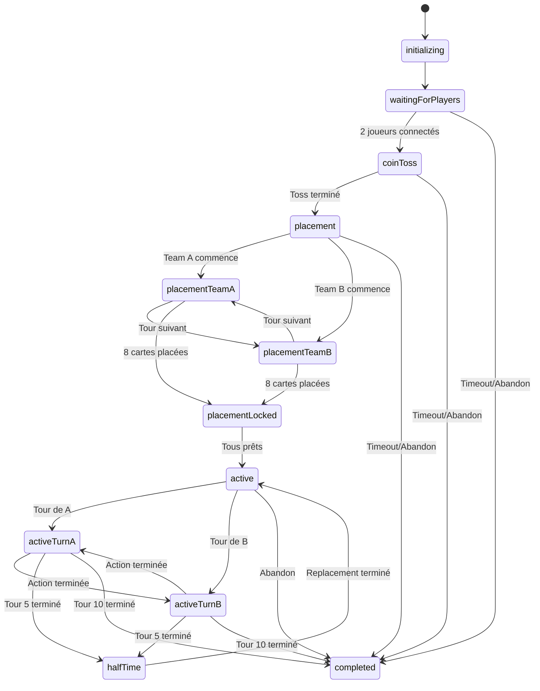

# Rocket Footy - FSM & Gestion des États

## Vue d'ensemble de la FSM

La FSM (Finite State Machine) est le cœur du système de jeu. Elle garantit que chaque partie suit un flux logique strict et empêche les actions non autorisées.



## Types et Interfaces TypeScript

```typescript
// Types des états
export type GameState = 
  | 'initializing'
  | 'waitingForPlayers'
  | 'coinToss'
  | 'placement'
  | 'placementTeamA'
  | 'placementTeamB'
  | 'placementLocked'
  | 'active'
  | 'activeTurnA'
  | 'activeTurnB'
  | 'halfTime'
  | 'completed';

// Events de transition
export type GameEvent =
  | { type: 'PLAYER_JOINED'; player: string }
  | { type: 'PLAYER_LEFT'; player: string }
  | { type: 'COIN_TOSS_COMPLETE'; winner: string }
  | { type: 'CARD_PLACED'; player: string; position: string }
  | { type: 'PLACEMENT_CONFIRMED'; player: string }
  | { type: 'ACTION_COMPLETE'; player: string }
  | { type: 'HALF_TIME_REACHED' }
  | { type: 'GAME_ENDED' }
  | { type: 'TIMEOUT'; currentState: GameState }
  | { type: 'ABANDON'; player: string };

// Contexte de la FSM
export interface GameContext {
  gameId: string;
  playerA: string;
  playerB: string;
  currentPlayer: string;
  currentTurn: number;
  coinTossWinner: string | null;
  scoreA: number;
  scoreB: number;
  boardState: BoardState;
  ballPosition: BoardPosition;
  timeouts: {
    turn: NodeJS.Timeout | null;
    global: NodeJS.Timeout | null;
  };
  placementCount: {
    [playerId: string]: number;
  };
}
```

## Configuration de la FSM

```typescript
import { createMachine, assign } from 'xstate';

export const gameMachine = createMachine<GameContext, GameEvent>({
  id: 'rocketFooty',
  initial: 'initializing',
  context: {
    gameId: '',
    playerA: '',
    playerB: '',
    currentPlayer: '',
    currentTurn: 0,
    coinTossWinner: null,
    scoreA: 0,
    scoreB: 0,
    boardState: {},
    ballPosition: 'Z2-2',
    timeouts: {
      turn: null,
      global: null
    },
    placementCount: {}
  },

  states: {
    initializing: {
      entry: 'initializeGame',
      on: {
        PLAYER_JOINED: {
          target: 'waitingForPlayers',
          actions: 'registerPlayer'
        }
      }
    },

    waitingForPlayers: {
      entry: 'setupWaitingRoom',
      on: {
        PLAYER_JOINED: [
          {
            target: 'coinToss',
            cond: 'allPlayersReady',
            actions: 'startCoinToss'
          },
          {
            actions: 'registerPlayer'
          }
        ],
        PLAYER_LEFT: {
          target: 'completed',
          actions: 'handleAbandon'
        },
        TIMEOUT: {
          target: 'completed',
          actions: 'handleTimeout'
        }
      },
      after: {
        45000: { target: 'completed', actions: 'handleTimeout' }
      }
    },

    coinToss: {
      entry: ['performCoinToss', 'notifyPlayers'],
      on: {
        COIN_TOSS_COMPLETE: {
          target: 'placement',
          actions: ['setCoinTossWinner', 'determineFirstPlacer']
        },
        TIMEOUT: {
          target: 'completed',
          actions: 'handleTimeout'
        }
      },
      after: {
        5000: { 
          target: 'placement',
          actions: 'autoCompleteCoinToss'
        }
      }
    },

    placement: {
      initial: 'placementTeamA',
      states: {
        placementTeamA: {
          entry: ['setCurrentPlayer', 'startTurnTimer'],
          on: {
            CARD_PLACED: {
              target: 'placementTeamB',
              cond: 'isCurrentPlayerAction',
              actions: ['placeCard', 'incrementPlacementCount']
            },
            TIMEOUT: {
              target: 'placementTeamB',
              actions: ['autoPlaceCard', 'penalizeTimeout']
            }
          },
          after: {
            20000: { 
              target: 'placementTeamB',
              actions: 'handlePlacementTimeout'
            }
          }
        },
        placementTeamB: {
          entry: ['setCurrentPlayer', 'startTurnTimer'],
          on: {
            CARD_PLACED: [
              {
                target: '#rocketFooty.placementLocked',
                cond: 'allCardsPlaced',
                actions: ['placeCard', 'incrementPlacementCount']
              },
              {
                target: 'placementTeamA',
                actions: ['placeCard', 'incrementPlacementCount']
              }
            ],
            TIMEOUT: {
              target: 'placementTeamA',
              actions: ['autoPlaceCard', 'penalizeTimeout']
            }
          },
          after: {
            20000: { 
              target: 'placementTeamA',
              actions: 'handlePlacementTimeout'
            }
          }
        }
      }
    },

    placementLocked: {
      entry: 'waitForConfirmations',
      on: {
        PLACEMENT_CONFIRMED: [
          {
            target: 'active',
            cond: 'allPlayersConfirmed',
            actions: 'startGame'
          },
          {
            actions: 'recordConfirmation'
          }
        ]
      },
      after: {
        5000: { 
          target: 'active',
          actions: 'autoStartGame'
        }
      }
    },

    active: {
      entry: 'initializeGamePlay',
      initial: 'activeTurnA',
      states: {
        activeTurnA: {
          entry: ['setCurrentPlayerA', 'startActionTimer', 'notifyTurn'],
          on: {
            ACTION_COMPLETE: [
              {
                target: '#rocketFooty.halfTime',
                cond: 'isHalfTime',
                actions: 'updateGameState'
              },
              {
                target: '#rocketFooty.completed',
                cond: 'isGameEnd',
                actions: 'endGame'
              },
              {
                target: 'activeTurnB',
                actions: 'updateGameState'
              }
            ],
            TIMEOUT: {
              target: 'activeTurnB',
              actions: ['autoAction', 'penalizeTimeout']
            },
            ABANDON: {
              target: '#rocketFooty.completed',
              actions: 'handleAbandon'
            }
          },
          after: {
            45000: { 
              target: 'activeTurnB',
              actions: 'handleActionTimeout'
            }
          }
        },
        activeTurnB: {
          entry: ['setCurrentPlayerB', 'startActionTimer', 'notifyTurn'],
          on: {
            ACTION_COMPLETE: [
              {
                target: '#rocketFooty.halfTime',
                cond: 'isHalfTime',
                actions: 'updateGameState'
              },
              {
                target: '#rocketFooty.completed',
                cond: 'isGameEnd',
                actions: 'endGame'
              },
              {
                target: 'activeTurnA',
                actions: 'updateGameState'
              }
            ],
            TIMEOUT: {
              target: 'activeTurnA',
              actions: ['autoAction', 'penalizeTimeout']
            },
            ABANDON: {
              target: '#rocketFooty.completed',
              actions: 'handleAbandon'
            }
          },
          after: {
            45000: { 
              target: 'activeTurnA',
              actions: 'handleActionTimeout'
            }
          }
        }
      }
    },

    halfTime: {
      entry: ['resetBoard', 'notifyHalfTime', 'distributeBonus'],
      on: {
        CARD_PLACED: {
          actions: 'placeHalfTimeCard'
        },
        PLACEMENT_CONFIRMED: [
          {
            target: 'active',
            cond: 'halfTimePlacementComplete',
            actions: 'resumeGame'
          }
        ]
      },
      after: {
        60000: { 
          target: 'active',
          actions: 'autoResumeFromHalfTime'
        }
      }
    },

    completed: {
      type: 'final',
      entry: ['calculateResults', 'updateMMR', 'saveHistory', 'notifyEnd']
    }
  }
});
```

## Actions de la FSM

```typescript
export const gameActions = {
  // Initialisation
  initializeGame: assign((context, event) => ({
    ...context,
    gameId: generateGameId(),
    boardState: initializeBoard(),
    ballPosition: 'Z2-2'
  })),

  // Gestion des joueurs
  registerPlayer: assign((context, event) => {
    if (event.type !== 'PLAYER_JOINED') return context;
    
    const updates: Partial<GameContext> = {};
    if (!context.playerA) {
      updates.playerA = event.player;
    } else if (!context.playerB) {
      updates.playerB = event.player;
    }
    
    return { ...context, ...updates };
  }),

  // Coin toss
  performCoinToss: (context) => {
    const winner = Math.random() < 0.5 ? context.playerA : context.playerB;
    // Envoyer résultat via Realtime
    sendRealtimeUpdate(context.gameId, {
      type: 'COIN_TOSS_RESULT',
      winner
    });
  },

  setCoinTossWinner: assign((context, event) => {
    if (event.type !== 'COIN_TOSS_COMPLETE') return context;
    return {
      ...context,
      coinTossWinner: event.winner,
      currentPlayer: event.winner // Le gagnant place en premier
    };
  }),

  // Placement
  placeCard: assign((context, event) => {
    if (event.type !== 'CARD_PLACED') return context;
    
    const newBoardState = { ...context.boardState };
    newBoardState[event.position] = {
      player: event.player,
      cardId: event.cardId
    };
    
    return {
      ...context,
      boardState: newBoardState
    };
  }),

  incrementPlacementCount: assign((context, event) => {
    if (event.type !== 'CARD_PLACED') return context;
    
    const count = context.placementCount[event.player] || 0;
    return {
      ...context,
      placementCount: {
        ...context.placementCount,
        [event.player]: count + 1
      }
    };
  }),

  // Actions de jeu
  updateGameState: assign((context, event) => {
    if (event.type !== 'ACTION_COMPLETE') return context;
    
    return {
      ...context,
      currentTurn: context.currentTurn + 1,
      scoreA: event.scoreA || context.scoreA,
      scoreB: event.scoreB || context.scoreB,
      ballPosition: event.ballPosition || context.ballPosition,
      boardState: event.boardState || context.boardState
    };
  }),

  // Gestion des timeouts
  startTurnTimer: (context) => {
    // Annuler l'ancien timer
    if (context.timeouts.turn) {
      clearTimeout(context.timeouts.turn);
    }
    
    // Nouveau timer
    const timer = setTimeout(() => {
      // Envoyer event TIMEOUT
      sendEvent(context.gameId, { type: 'TIMEOUT' });
    }, 45000);
    
    return assign({
      timeouts: {
        ...context.timeouts,
        turn: timer
      }
    });
  },

  // Fin de partie
  calculateResults: async (context) => {
    const result = {
      winner: context.scoreA > context.scoreB ? context.playerA : 
              context.scoreA < context.scoreB ? context.playerB : null,
      scoreA: context.scoreA,
      scoreB: context.scoreB,
      duration: Date.now() - context.startTime,
      turns: context.currentTurn
    };
    
    // Sauvegarder en base
    await saveGameResult(context.gameId, result);
  },

  updateMMR: async (context) => {
    const playerAProfile = await getProfile(context.playerA);
    const playerBProfile = await getProfile(context.playerB);
    
    const mmrChanges = calculateMMRChange(
      playerAProfile.mmr,
      playerBProfile.mmr,
      context.scoreA === context.scoreB
    );
    
    await updateProfile(context.playerA, {
      mmr: playerAProfile.mmr + mmrChanges.winner_change,
      wins: context.scoreA > context.scoreB ? playerAProfile.wins + 1 : playerAProfile.wins,
      losses: context.scoreA < context.scoreB ? playerAProfile.losses + 1 : playerAProfile.losses,
      draws: context.scoreA === context.scoreB ? playerAProfile.draws + 1 : playerAProfile.draws
    });
    
    await updateProfile(context.playerB, {
      mmr: playerBProfile.mmr + mmrChanges.loser_change,
      wins: context.scoreB > context.scoreA ? playerBProfile.wins + 1 : playerBProfile.wins,
      losses: context.scoreB < context.scoreA ? playerBProfile.losses + 1 : playerBProfile.losses,
      draws: context.scoreA === context.scoreB ? playerBProfile.draws + 1 : playerBProfile.draws
    });
  }
};
```

## Guards (Conditions)

```typescript
export const gameGuards = {
  // Vérifier si tous les joueurs sont présents
  allPlayersReady: (context) => {
    return !!context.playerA && !!context.playerB;
  },

  // Vérifier si c'est l'action du joueur actuel
  isCurrentPlayerAction: (context, event) => {
    return event.player === context.currentPlayer;
  },

  // Vérifier si toutes les cartes sont placées
  allCardsPlaced: (context) => {
    const countA = context.placementCount[context.playerA] || 0;
    const countB = context.placementCount[context.playerB] || 0;
    return countA === 8 && countB === 8;
  },

  // Vérifier si tous ont confirmé
  allPlayersConfirmed: (context) => {
    return context.confirmations?.size === 2;
  },

  // Vérifier si c'est la mi-temps
  isHalfTime: (context) => {
    return context.currentTurn === 5;
  },

  // Vérifier si c'est la fin du jeu
  isGameEnd: (context) => {
    return context.currentTurn === 10;
  },

  // Vérifier si le placement mi-temps est complet
  halfTimePlacementComplete: (context) => {
    return context.halfTimePlacements?.size === 2;
  }
};
```

## Intégration avec Supabase Realtime

```typescript
export class GameStateManager {
  private machine: any;
  private service: any;
  private channel: RealtimeChannel;

  constructor(gameId: string) {
    this.machine = gameMachine.withConfig({
      actions: gameActions,
      guards: gameGuards
    });

    this.service = interpret(this.machine)
      .onTransition((state) => {
        this.broadcastStateChange(state);
      })
      .start();

    this.initializeRealtimeChannel(gameId);
  }

  private initializeRealtimeChannel(gameId: string) {
    this.channel = supabase
      .channel(`game:${gameId}`)
      .on('broadcast', { event: 'game_event' }, ({ payload }) => {
        this.service.send(payload);
      })
      .subscribe();
  }

  private broadcastStateChange(state: any) {
    this.channel.send({
      type: 'broadcast',
      event: 'state_update',
      payload: {
        state: state.value,
        context: state.context
      }
    });
  }

  public sendEvent(event: GameEvent) {
    // Validation côté client
    if (this.validateEvent(event)) {
      this.service.send(event);
      
      // Broadcast aux autres joueurs
      this.channel.send({
        type: 'broadcast',
        event: 'game_event',
        payload: event
      });
    }
  }

  private validateEvent(event: GameEvent): boolean {
    const currentState = this.service.state;
    
    // Vérifier si l'event est autorisé dans l'état actuel
    switch (currentState.value) {
      case 'activeTurnA':
        return event.player === currentState.context.playerA;
      case 'activeTurnB':
        return event.player === currentState.context.playerB;
      default:
        return true;
    }
  }
}
```

## Gestion des reconnexions

```typescript
export class ReconnectionManager {
  static async handleReconnection(
    userId: string,
    gameId: string
  ): Promise<GameReconnectionData> {
    // Récupérer l'état du jeu depuis la DB
    const game = await supabase
      .from('games')
      .select('*')
      .eq('id', gameId)
      .single();

    if (!game.data) {
      throw new Error('Game not found');
    }

    // Vérifier si le joueur fait partie de la partie
    if (game.data.player_a !== userId && game.data.player_b !== userId) {
      throw new Error('Unauthorized');
    }

    // Récupérer l'historique des moves
    const moves = await supabase
      .from('moves')
      .select('*')
      .eq('game_id', gameId)
      .order('turn_number', { ascending: true });

    // Reconstruire l'état
    const reconstructedState = this.reconstructGameState(
      game.data,
      moves.data
    );

    return {
      gameState: reconstructedState,
      currentPlayer: game.data.current_player,
      canPlay: game.data.current_player === userId,
      timeRemaining: this.calculateTimeRemaining(game.data.turn_started_at)
    };
  }

  private static reconstructGameState(game: any, moves: any[]): any {
    // Logique de reconstruction de l'état
    return {
      status: game.status,
      boardState: game.board_state,
      ballPosition: game.ball_position,
      scores: {
        a: game.score_a,
        b: game.score_b
      },
      turn: game.current_turn,
      moves: moves
    };
  }

  private static calculateTimeRemaining(turnStartedAt: string): number {
    if (!turnStartedAt) return 45;
    
    const elapsed = Date.now() - new Date(turnStartedAt).getTime();
    const remaining = 45000 - elapsed;
    
    return Math.max(0, Math.floor(remaining / 1000));
  }
}
```

## Gestion des erreurs et edge cases

```typescript
export class ErrorHandler {
  static handleGameError(error: GameError, context: GameContext): void {
    switch (error.type) {
      case 'DISCONNECTION':
        this.handleDisconnection(error, context);
        break;
      case 'INVALID_ACTION':
        this.handleInvalidAction(error, context);
        break;
      case 'TIMEOUT':
        this.handleTimeout(error, context);
        break;
      case 'SYNC_ERROR':
        this.handleSyncError(error, context);
        break;
    }
  }

  private static handleDisconnection(error: any, context: GameContext) {
    // Marquer le joueur comme déconnecté
    // Démarrer un timer de reconnexion
    // Si pas de reconnexion dans les 45s, abandon automatique
  }

  private static handleInvalidAction(error: any, context: GameContext) {
    // Logger l'action invalide
    // Notifier le joueur
    // Potentiellement marquer comme tentative de triche
  }

  private static handleTimeout(error: any, context: GameContext) {
    // Appliquer l'action par défaut
    // Pénaliser le joueur (warning, puis sanctions)
    // Continuer le jeu
  }

  private static handleSyncError(error: any, context: GameContext) {
    // Tenter de resynchroniser avec le serveur
    // Si échec, forcer la reconnexion
    // En dernier recours, terminer la partie
  }
}
```

## Monitoring et Analytics

```typescript
export class GameMonitor {
  static trackStateTransition(
    gameId: string,
    fromState: GameState,
    toState: GameState,
    event: GameEvent
  ) {
    // Logger pour analytics
    analytics.track('game_state_transition', {
      gameId,
      fromState,
      toState,
      event: event.type,
      timestamp: Date.now()
    });
  }

  static trackPlayerAction(
    gameId: string,
    playerId: string,
    action: any,
    duration: number
  ) {
    analytics.track('player_action', {
      gameId,
      playerId,
      actionType: action.type,
      duration,
      success: action.success,
      timestamp: Date.now()
    });
  }

  static detectAnomalies(gameId: string, pattern: any) {
    // Détecter les patterns suspects
    // - Actions trop rapides
    // - Déconnexions répétées
    // - Timing parfait constant
    
    if (pattern.suspicious) {
      this.flagForReview(gameId, pattern);
    }
  }
}
```